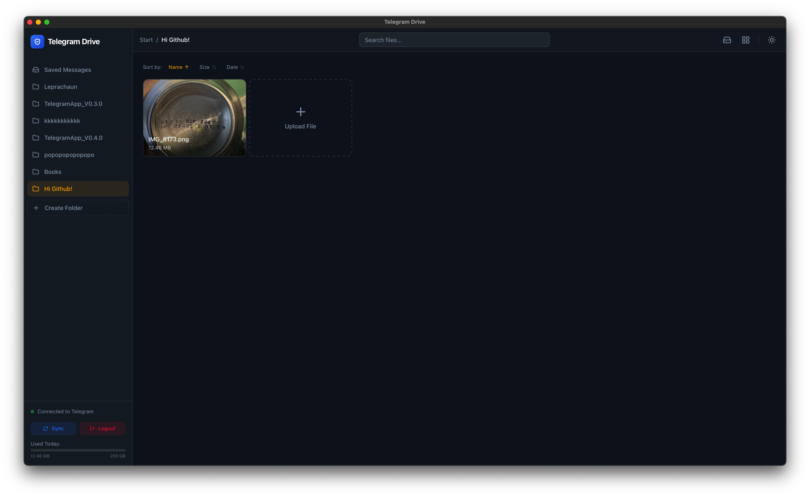
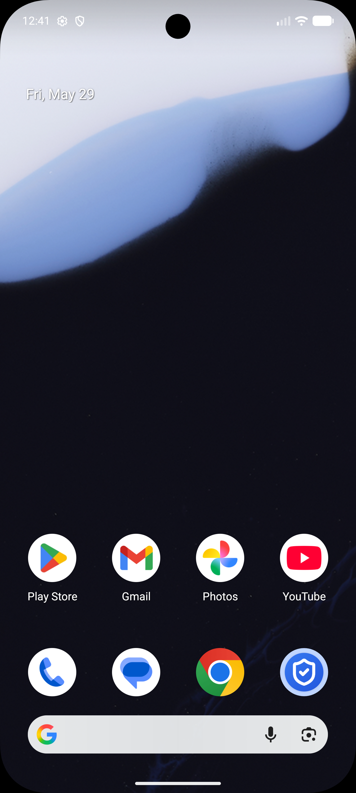
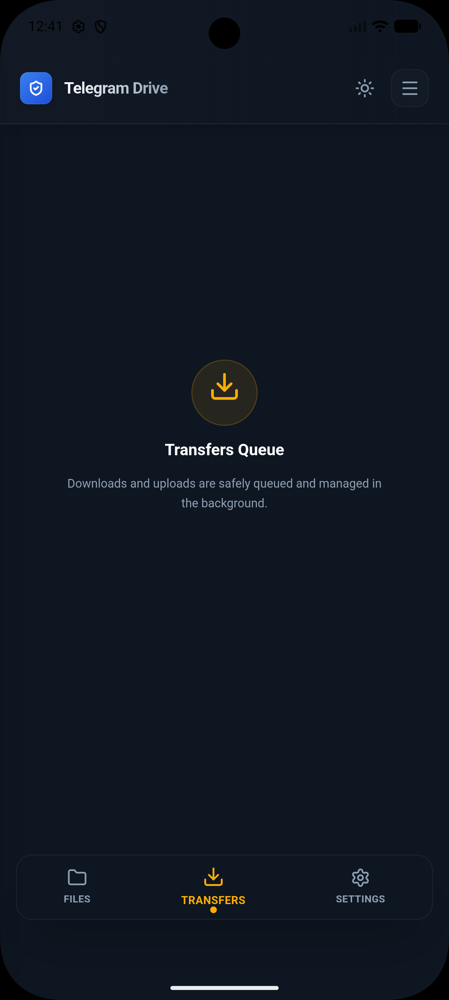

# Telegram Drive

**Telegram Drive** is an open-source, cross-platform desktop application that turns
your Telegram account into an unlimited, secure cloud storage drive. Built with
**Tauri**, **Rust**, and **React**.

##  What is Telegram Drive?

Telegram Drive leverages the Telegram API to allow you to upload, organize, and manage files directly on Telegram's servers. It treats your "Saved Messages" and created Channels as folders, giving you a familiar file explorer interface for your Telegram cloud.

###  Key Features

*   **Unlimited Cloud Storage**: Utilizing Telegram's generous cloud infrastructure.
*   **High Performance Grid**: Virtual scrolling handles folders with thousands of files instantly.
*   **Auto-Updates**: Seamless updates for Windows, macOS, and Linux.
*   **Media Streaming**: Stream video and audio files directly without downloading.
*   **PDF Viewer:** Built-in PDF support with infinite scrolling for seamless document reading.
*   **Drag & Drop**: Intuitive drag-and-drop upload and file management.
*   **Thumbnail Previews**: Inline thumbnails for images and media files.
*   **Folder Management**: Create "Folders" (private Telegram Channels) to organize content.
*   **Shareable Links**: Generate direct download links with optional password protection and expiration, and revoke access anytime from the dashboard. Also supports copying native Telegram message links for files in public channels.
*   **REST API for AI Integration**: Secure local API (off by default) with configurable port and API key auth. OpenAPI spec for seamless LLM and tool integration.
*   **Proxy Support**: Native integration for SOCKS5 and MTProto proxies to bypass regional restrictions and secure your traffic.
*   **VPN Optimizer**: Aggressive network tuning including bandwidth throttling, adjustable transfer chunk sizing, and adaptive keep-alives to ensure maximum stability on high-latency connections.
*   **Privacy Focused**: API keys and data stay local. No third-party servers.
*   **Cross-Platform**: Native apps for macOS (Intel/ARM), Windows, Linux and Android.

##  Screenshots

### Desktop App

| Dashboard | File Preview |
|-----------|--------------|
|  |  |

| Grid View | Authentication |
|-----------|----------------|
|  |  |

| Audio Playback | Video Playback |
|----------------|----------------|
|  |  |

| Auth Code Screen | Upload Example |
|------------------|-------------|
|  |  |

| Folder Creation | Folder List View |
|-----------------|------------------|
|  |  |

### Android App

| Home Screen | Splash Screen | Dark Mode Folder View |
|-------------|---------------|-----------------------|
|  |  |  |

| Folder List | Transfer Queue | Settings Page |
|-------------|----------------|---------------|
|  |  |  |

##  Tech Stack

*   **Frontend**: React, TypeScript, TailwindCSS, Framer Motion
*   **Backend**: Rust (Tauri), Grammers (Telegram Client)
*   **Build Tool**: Vite

##  Getting Started

##  Open Source & License

This project is **Free and Open Source Software**. You are free to use, modify, and distribute it.

Licensed under the **MIT License**.

---
*Disclaimer: This application is not affiliated with Telegram FZ-LLC. Use responsibly and in accordance with Telegram's Terms of Service.*

---
