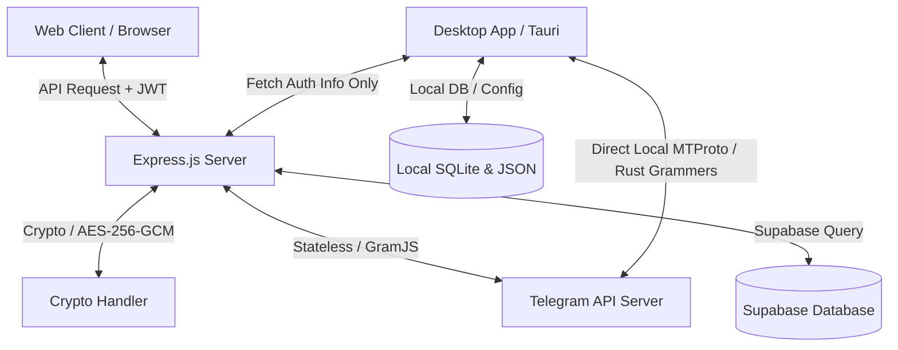

# Dokumentasi Arsitektur Telegram Drive (Multi-User SaaS)

Folder ini berisi dokumentasi teknis mengenai alur kerja (workflow) dan struktur database yang diimplementasikan pada Telegram Drive versi Multi-User.

## Daftar Dokumen Teknis

1. **[Struktur Database (DATABASE.md)](file:///c:/Users/ibrah/Downloads/teledrive/docs/DATABASE.md)**
   Menjelaskan struktur tabel, keamanan enkripsi sesi, kebijakan RLS (Row Level Security), dan variabel lingkungan (.env) yang digunakan.
   
2. **[Alur Kerja Sistem (WORKFLOW.md)](file:///c:/Users/ibrah/Downloads/teledrive/docs/WORKFLOW.md)**
   Menjelaskan alur autentikasi ganda (Supabase Portal + Telegram OTP), manajemen memori client aktif (Multi-Client Manager), dan alur streaming file.

3. **[Panduan Deploy Backend (DEPLOY_HUGGINGFACE.md)](file:///c:/Users/ibrah/Downloads/teledrive/docs/DEPLOY_HUGGINGFACE.md)**
   Menjelaskan langkah demi langkah proses deploy server backend menggunakan Hugging Face Spaces secara gratis tanpa kartu kredit.

## Peta Arsitektur Sistem

### Penjelasan Arsitektur Ganda (Dual Architecture)
Aplikasi ini menggunakan dua pendekatan berbeda tergantung pada jenis klien yang digunakan:
1. **Web Client (Browser):** Sepenuhnya bergantung pada server **Express.js (Node.js)** sebagai perantara (Proxy). Semua proses login, pengambilan file, *streaming*, dan *download* dilakukan oleh server Express.js menggunakan pustaka `GramJS`.
2. **Desktop App (Tauri):** Merupakan aplikasi *standalone*. Server Express.js hanya digunakan di awal untuk sinkronisasi kredensial secara aman. Setelah itu, Desktop App menggunakan **Backend Rust bawaannya sendiri (menggunakan pustaka `grammers`)** untuk terhubung langsung ke Telegram API secara lokal. Streaming dan download di desktop **TIDAK** membebani server Node.js Anda.
