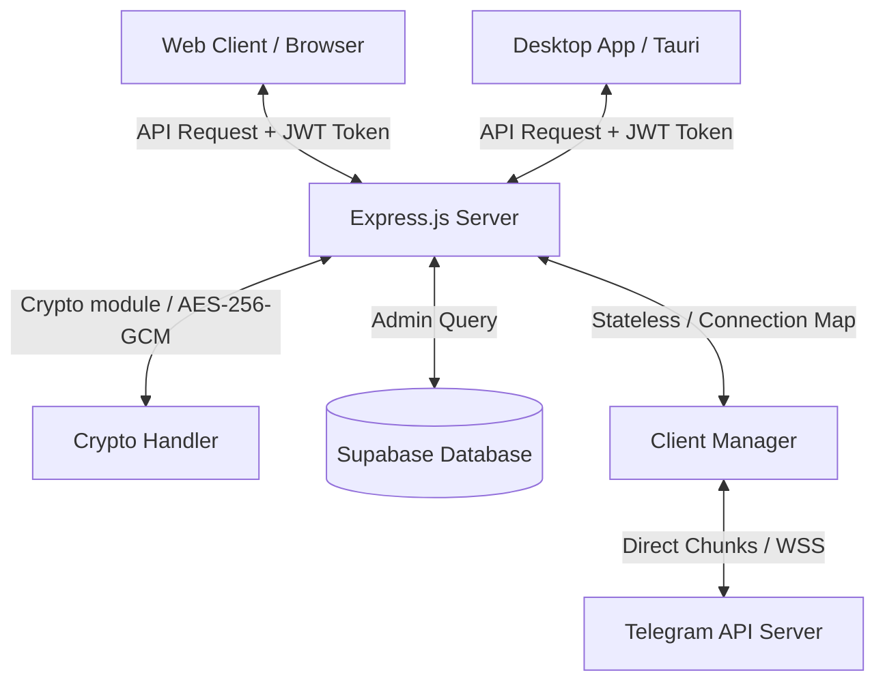

# Dokumentasi Arsitektur Telegram Drive (Multi-User SaaS)

Folder ini berisi dokumentasi teknis mengenai alur kerja (workflow) dan struktur database yang diimplementasikan pada Telegram Drive versi Multi-User.

## Daftar Dokumen Teknis

1. **[Struktur Database (DATABASE.md)](file:///c:/Users/ibrah/Downloads/teledrive/docs/DATABASE.md)**
   Menjelaskan struktur tabel, keamanan enkripsi sesi, kebijakan RLS (Row Level Security), dan variabel lingkungan (.env) yang digunakan.
   
2. **[Alur Kerja Sistem (WORKFLOW.md)](file:///c:/Users/ibrah/Downloads/teledrive/docs/WORKFLOW.md)**
   Menjelaskan alur autentikasi ganda (Supabase Portal + Telegram OTP), manajemen memori client aktif (Multi-Client Manager), dan alur streaming file.

3. **[Panduan Deploy Backend (DEPLOY_HUGGINGFACE.md)](file:///c:/Users/ibrah/Downloads/teledrive/docs/DEPLOY_HUGGINGFACE.md)**
   Menjelaskan langkah demi langkah proses deploy server backend menggunakan Hugging Face Spaces secara gratis tanpa kartu kredit.

## Peta Arsitektur Sistem

