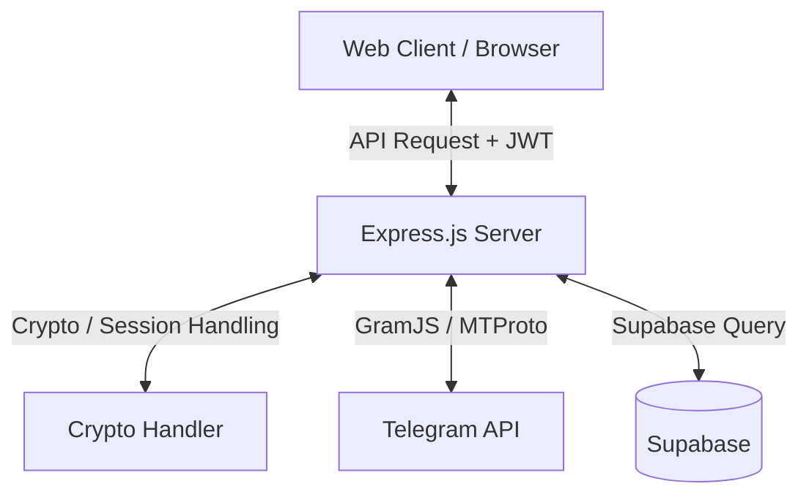

# Dokumentasi Teledrive

Folder ini berisi dokumentasi teknis utama untuk Teledrive versi web / multi-user.

## Daftar Dokumen

1. **[Development Roadmap](./DEVELOPMENT_ROADMAP.md)**
   - roadmap pengembangan web
   - ringkasan sprint yang sudah selesai
   - prioritas next step

2. **[Workflow](./WORKFLOW.md)**
   - alur autentikasi
   - lifecycle client Telegram
   - alur streaming/upload/download

3. **[Database](./DATABASE.md)**
   - struktur data utama
   - catatan persistence/indexing

4. **[Deploy Backend](./DEPLOY_HUGGINGFACE.md)**
   - panduan deployment lama/reference

## Catatan

Dokumen roadmap lama di root seperti `WEB_ROADMAP.md` dan `SPRINT1_MEDIA_PLAN.md` sudah dikonsolidasikan ke:
- `docs/DEVELOPMENT_ROADMAP.md`

## Peta Arsitektur Ringkas

