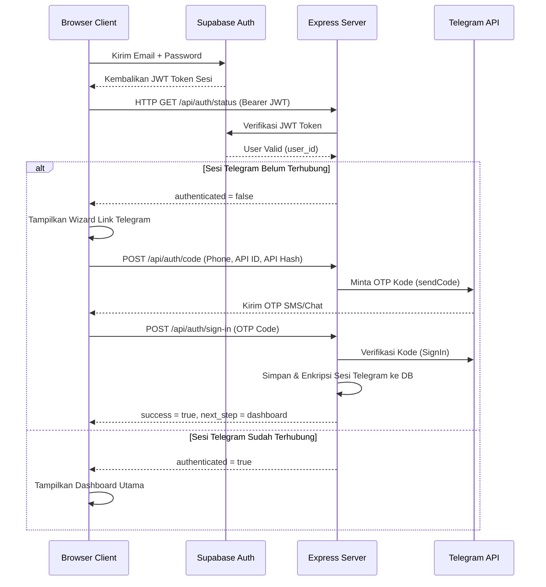

# Dokumentasi Alur Kerja Sistem (Workflow)

Dokumen ini menjelaskan alur kerja internal aplikasi Telegram Drive Multi-User SaaS mulai dari login pengguna hingga proses streaming file.

---

## 1. Alur Autentikasi Pengguna (Authentication Flow)

Proses autentikasi dibagi menjadi dua lapis:
1. **Portal Auth (Supabase):** Autentikasi email & password untuk masuk ke web portal.
2. **Telegram Link (GramJS):** Menyambungkan akun Telegram menggunakan API ID, API Hash, dan nomor telepon (OTP).

### Diagram Alur Pendaftaran & Login:

---

## 2. Pendaftaran Berbasis Undangan (Invite-Only Registration)

Sebelum dapat menggunakan portal, pengguna baru wajib melakukan registrasi dengan **Token Undangan** yang dibuat oleh Administrator.

### Alur Registrasi:
1. Pengguna memasukkan **Email**, **Password**, dan **Token Undangan** pada formulir pendaftaran di peramban.
2. Request dikirim ke endpoint publik `/api/auth/register-invite`.
3. Server memverifikasi apakah token tersebut terdaftar di tabel `public.invitations` dan kolom `used_at` bernilai `null` (belum terpakai).
4. Jika valid, server mendaftarkan pengguna baru secara aman via Supabase Admin Auth API dan menyetel status email terverifikasi secara otomatis.
5. Server memperbarui tabel `public.invitations` dan mengisi kolom `used_at` dengan waktu saat pendaftaran untuk menandai token sudah hangus/terpakai.

---

## 3. Manajemen Sesi Multi-Client (ClientManager)

Untuk menangani banyak pengguna secara efisien tanpa menghabiskan RAM server, Express Server menggunakan modul **`clientManager.js`**.

### Mekanisme Kerja:
1. **Map In-Memory (`activeClients`):** Menyimpan objek `TelegramClient` yang aktif dipetakan berdasarkan `user_id` (UUID Supabase).
2. **Dynamic Client Resolution:** Setiap kali request masuk ke endpoint Express (misalnya `/api/files`):
   * Middleware `checkAuth` memverifikasi token JWT dan mendapatkan `user_id`.
   * Sistem memeriksa apakah client Telegram untuk `user_id` sudah ada di `activeClients`.
   * Jika **ada**, client tersebut langsung digunakan dan timestamp `lastActive` diperbarui.
   * Jika **tidak ada**, sistem memuat sesi terenkripsi dari Supabase, mendekripsinya, menginisialisasi `TelegramClient` baru, menghubungkannya, lalu menyimpannya di `activeClients`.
3. **Idle Client Cleanup (Pembersihan RAM Otomatis):**
   * Di latar belakang server, terdapat interval pembersih yang berjalan setiap 10 menit.
   * Fungsi ini memindai `activeClients` dan mendeteksi sambungan pengguna yang tidak melakukan aktivitas selama lebih dari **30 menit**.
   * Koneksi idle tersebut otomatis diputus (`client.disconnect()`) dan dihapus dari memori RAM untuk menjaga kestabilan server.

---

## 4. Alur Streaming File Video & Audio

Aplikasi mendukung **HTTP Range Requests** yang memungkinkan pemutaran video secara instan tanpa menunggu seluruh file terunduh.

### Cara Kerja:
1. Pemutar video (HTML5 `<video>`) mengirim request GET ke `/api/files/:id/download` dengan header `Range: bytes=start-end`.
2. Middleware backend mendeteksi token dalam parameter query URL (`?token=<JWT>`) karena tag `<video>` tidak mendukung custom headers.
3. Server memverifikasi token dan mengambil client Telegram yang sesuai.
4. Server mengirimkan respons **`206 Partial Content`** dengan header:
   * `Content-Range: bytes start-end/fileSize`
   * `Accept-Ranges: bytes`
5. Server menggunakan generator **`client.iterDownload`** untuk mengambil byte range yang diminta secara presisi langsung dari Telegram, lalu mengalirkannya (*piping*) ke browser.
6. **Penanganan `LIMIT_INVALID`:** Offset download diselaraskan secara dinamis dengan kelipatan **1MB (1048576 byte)** yang dipersyaratkan oleh Telegram API untuk mencegah crash saat seek video.

---

## 5. Pengunggahan File Langsung (Streaming Upload)

Sistem menggunakan **`busboy`** untuk memproses pengunggahan file dari peramban secara streaming.
* Berkas yang diunggah dibaca langsung sebagai aliran byte dari request HTTP.
* Berkas **tidak pernah disimpan di media penyimpanan harddisk server**, melainkan dialirkan langsung ke RAM Buffer (Maksimal batas aman **2GB**) dan langsung disalurkan ke Telegram API via `client.sendFile`.
* Mencegah server dari crash akibat kehabisan ruang disk (*Out of Disk Space*).

---

## 6. Perlindungan Keamanan & Laju Request (Rate Limiting)

Untuk melindungi API dan akun Telegram dari serangan atau ban (*Flood Wait*):
* **Rate Limiting:** Seluruh rute `/api/` dibatasi maksimal **120 request per IP per menit**.
* **Upload Limiting:** Rute `/api/files/upload` dibatasi maksimal **10 unggahan per IP per menit**.
* **CORS Whitelist:** API backend dikonfigurasi menggunakan kebijakan CORS terpusat yang membatasi akses hanya dari domain terdaftar dalam variabel lingkungan `ALLOWED_ORIGINS` (mendukung wildcard `*`).

